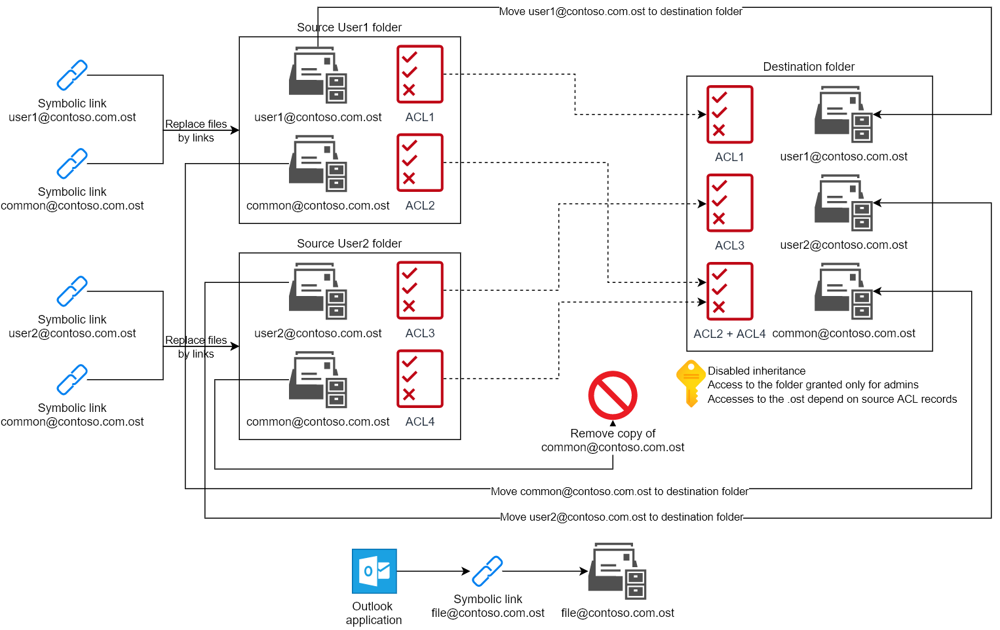

# single-ost-many-users
Tool for making one OST usable for many users. If you have users who added the same OSTs to their Outlook, you can remove duplicates and make single OST usable for many users with the tool.

## When is it usable?

If you have workstations which are used by many people with separate accounts but they have additional common mail accounts which were created also as an account (not shared mailbox or distribution group).

Let me explain an conception:

For example, you have a shared workstation used by your technical service. They use theirs personal accounts and also account with mailbox tech@contoso.com. The technicians while using their personal accounts also adding this shared account tech@contoso.com to the Outlook to recieve all emails. Added multiple times account tech@contoso.com creates multiple Outlook data files tech@contoso.com.ost which are the same for each user and just taking out disk space. You can optimize the usage of this files with this script which was designed to remove this duplicates.

**Users should log out (or reboot the workstation if they do not know how to log out) each time they switch account on the workstation.** If they will not do this, opened in other session Outlook will keep .ost file and will not allow open it in the current session.

## How does it works?

The script works according to that algorithm:

1. Gets destination path and creates new folder named OSTs with disabled inheritance and only buitlin\administrators and system access rights.

2. Gets the list of users folders.

3. For each user folder checks if there is any .ost files.

4. Gets access rights for the file.

5. Copies the file to destination folder, then removes source file and creates symbolic link.

6. Adds access rights to the each file in destination folder according to the source folder access list.

On the each step implementation, the script writes all useful information to the log file and after the processing it appends error messages.
